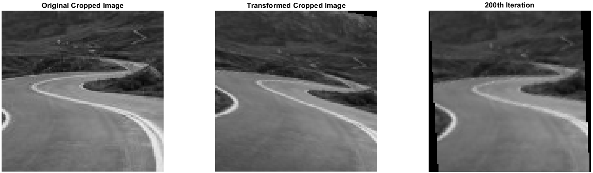
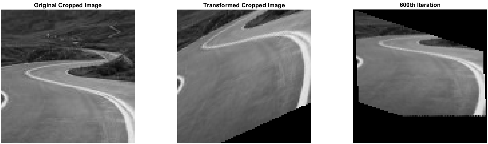
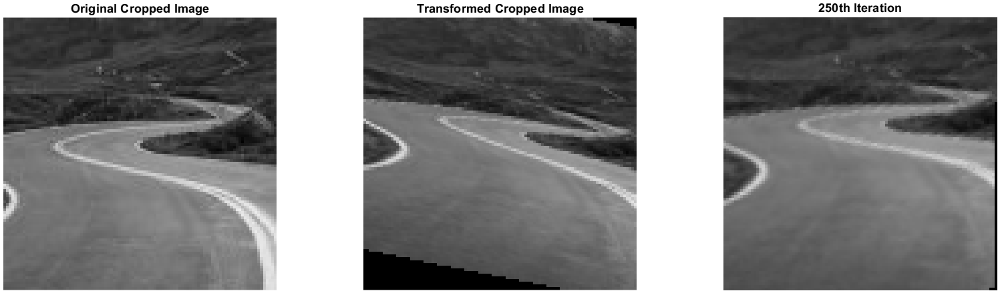
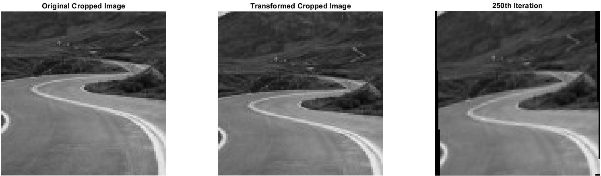

# Least-Squares-Correlation

MATLAB implementation of Least Squares Correlation/Matching (**LSM**) with grey value differences and gradients along the axes. Implemented as an optional project for Photogrammetric Computer Vision course at Bauhaus-Universität Weimar.

## Description
Algorithm takes a greyscale `150x150` image as an input and with an arbitrarily chosen affine deformation matrix produces a distorted image to be iteratively re-transformed back to its initial state with **LSM**. After fine-tuning the parameters, a target image and its 3 deformed versions are tested against the system for evaluation. Images can be found in the `img` folder. Number of iterations are manually adjusted for the best result. To avoid unnecessary void that may be caused by the deformations, images are cropped in center by `100x100` size.

## Arbitrarily chosen deformation matrices
In the `main.m` file, there are 4 matrices to be applied and manually chosen. The matrices are stored in the `H_0` variable. To test with the source image and application of transformation matrices, refer to the comments in the file.
## Evaluation
Referring to the comments and instructions in the `main.m` file, you'll be able to take the target image and the 3 distorted images as inputs and evaluate overall performance of the algorithm. Evaluation images are `135x135` in size.
## Results

